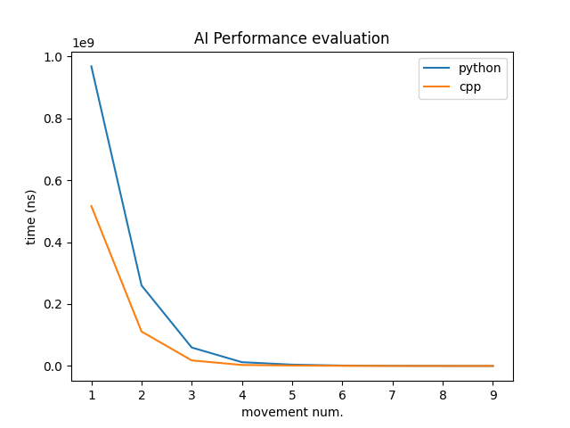

# AI Performance evaluation

One of the targets of this project is the evaluation of the AI algorithm performance in both Python and C++. For that matter, the algorithm has been implemented in both languages ([here for Python](https://github.com/jologar/tac-tac-toe-ai/blob/master/ai.py#L33) and [here for C++](https://github.com/jologar/tac-tac-toe-ai/blob/master/fastai/fast_ai.cpp)).

Below are included the evaluation results but, if you like, you can run it yourself executing the [evaluation script](https://github.com/jologar/tac-tac-toe-ai/blob/master/evaluation.py):

```
python3 evaluation.py
```

If you do so, it will prompt you to introduce the number of iterations of the game you like to execute (the higher the number, the more representative will be the results, but more time you'll be waiting for it to finish).


Once the script finish all the case iterations, it will store the results in two different files in the `profile` folder. The files will be named
```
python_ai_perf_<datetime>
cpp_ai_perf_<datetime>
```
The content of the file stores the processor time consumed by the AI [`getPlayerMove`](https://github.com/jologar/tac-tac-toe-ai/blob/master/ai.py#L24) method. The processor time has been chosen over simple time in order to avoid deviations produced by other other processes getting round time in the processor in between. That way, the evaluation can be more accurate.

## Results

(WIP)

Graphical representation of the results of the evaluation:


